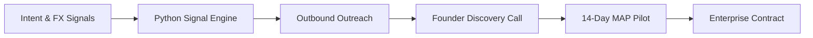

# Kavodax — Founding GTM & Sales Strategy Toolkit

Executive Go-To-Market strategy, outbound prospecting engines, and founder-led sales playbooks developed for Kavodax leadership.

---

### GTM Signal & Sales Architecture

---

### Repository Contents

| Module | File | Core Strategic Focus |
| :--- | :--- | :--- |
| **01** | `01_Founding_ICP_and_Outbound_Segmentation.md` | Enterprise Cross-Border ICP, CFO/Treasurer personas, and FX trigger signals |
| **02** | `02_Founder_Led_Sales_Playbook.md` | Discovery frameworks, pilot conversion criteria, and objection handling |
| **03** | `03_Outbound_Signal_Prospecting_Script.py` | Python prototype for signal-based account enrichment and copy generation |
| **04** | `04_Zero_To_One_90_Day_GTM_Roadmap.md` | 30-60-90 day execution milestones for early-stage revenue scaling |
| **05** | `05_CFO_ROI_and_BVA_Calculator.py` | Financial ROI calculator, unit economics, and payback period model |
| **06** | `06_Signal_Prospecting_Engine.md` | Signal scraper and lead generation pipeline architecture |
| **07** | `07_CFO_Trust_and_Compliance_FAQ.md` | Enterprise trust, FINTRAC/PSP regulatory compliance, and security FAQ |
| **08** | `08_Discovery_and_Demo_Script.md` | Structured discovery call script and live demo execution framework |
| **09** | `09_Corridor_Expansion.md` | Strategic framework for CAD-EUR and CAD-BRL expansion corridors |

---

### Functional Architecture

**Strategy & Market Expansion**
* `01_Founding_ICP_and_Outbound_Segmentation.md`
* `04_Zero_To_One_90_Day_GTM_Roadmap.md`
* `09_Corridor_Expansion.md`

**Sales Execution & Enterprise Trust**
* `02_Founder_Led_Sales_Playbook.md`
* `07_CFO_Trust_and_Compliance_FAQ.md`
* `08_Discovery_and_Demo_Script.md`

**Technical Tooling & Financial Models**
* `03_Outbound_Signal_Prospecting_Script.py`
* `05_CFO_ROI_and_BVA_Calculator.py`
* `06_Signal_Prospecting_Engine.md`
